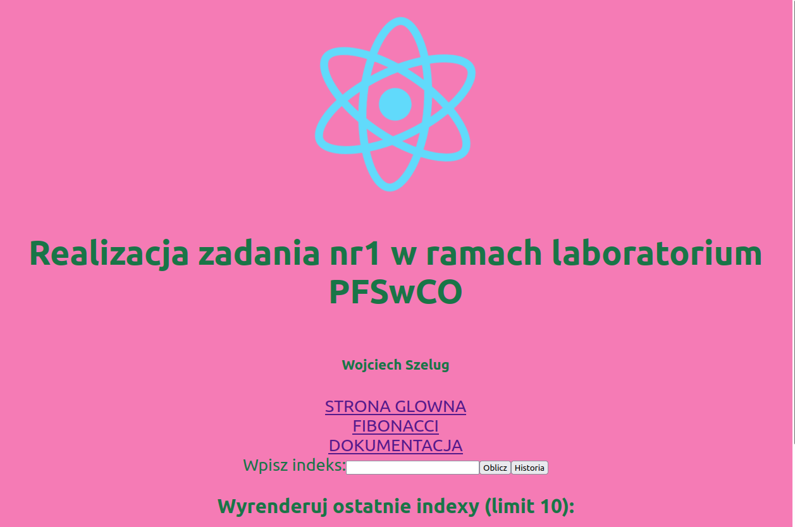

# PFSwChO_projekt1
# ZMIENIONO ZAWARTOSC ZADANIA 9:
## Dodano:
- **Zmieniono wersje obrazow postgres i redis z latest na konkretne wersje**
- **Plik .env i przypisanie zmiennych w docker-compose**
- **Reactowe komponenty dla dokumentacji i kalkulatora**        
- **Ograniczenie licznika kalkulatora dla 20 wartosci**
- **dodanie przycisku "Historia indeksow" wyświetlającego 10 ostatnich indeksów**
      
## Instrukcja uruchomienia:
      
- **git clone https://github.com/Crimsey/PFSwChO_projekt1.git**
- **docker-compose up**
- **Nalezy wejsc pod adres 0.0.0.0:3050**

      
## Screenshot aplikacji:

